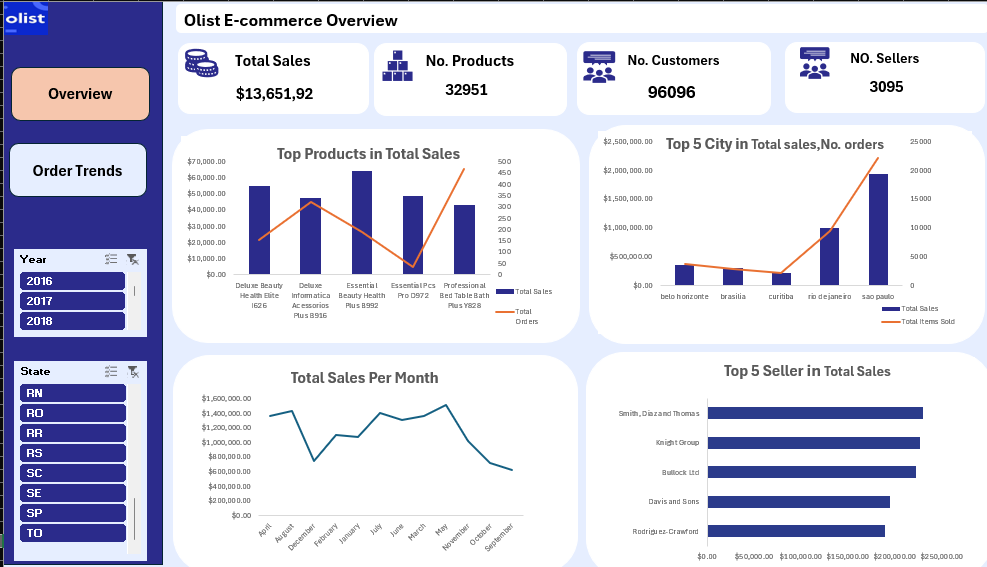
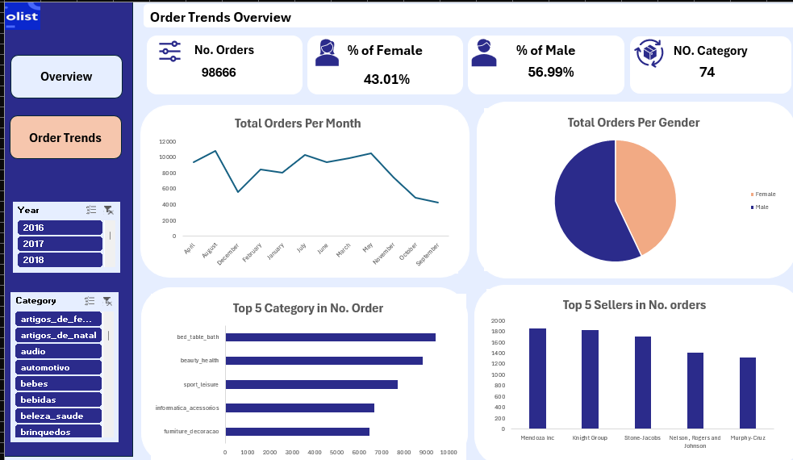

# E-commerce-Dashboard-Excel  

## Overview  
This project features an **interactive Excel dashboard powered by SSAS (SQL Server Analysis Services)** for analyzing **Olist's e-commerce data**.  
The dashboard provides insights into **total sales, customer trends, top-selling products, and order distributions over time** using **Pivot Tables, Charts, and Data Models**.  

## Key Features  

### Sales Overview  
- Displays **total sales, number of products, customers, and sellers**.  

### Top Products & Sellers  
- Identifies **highest-grossing products and top-performing sellers**.  

### Geographical Insights  
- Analyzes **sales distribution** across different **cities and states**.  
- Identifies **top cities with the highest sales and order volumes**.  

### Order Trends  
- Tracks **monthly order trends** to understand **seasonal variations**.  
- Compares order distribution **by gender and product category**.  

### Pivot Tables & Data Analysis  
- Uses **Pivot Tables** to dynamically analyze large datasets.  
- Filters data by **year, state, and product category** for deeper insights.  
- Enhances data visualization with **Pivot Charts and slicers**.  

## Technologies Used  
- **Excel** for dashboard creation, Pivot Tables, and interactive charts.  
- **SSAS (SQL Server Analysis Services)** for advanced data modeling and processing.  
- **SQL** for querying and aggregating e-commerce data before visualization.  

## Screenshots  
### Sales Overview Dashboard  

### Order Trends Dashboard  

  

## Conclusion  
This **SSAS-powered Excel dashboard** provides **comprehensive insights** into Olist's e-commerce data, helping businesses **identify trends, optimize sales strategies, and improve decision-making**.  
